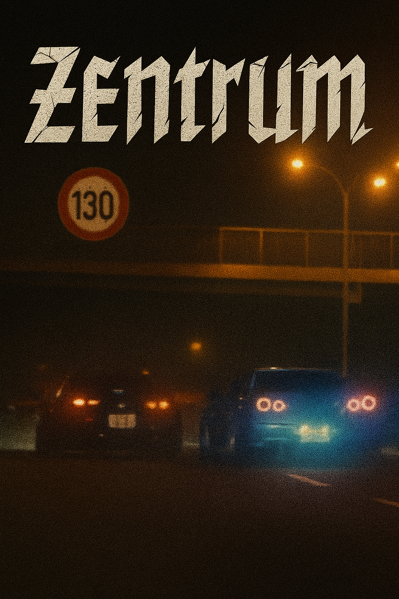

<html lang="de">
<head>
  <meta charset="UTF-8">
  <meta name="viewport" content="width=device-width, initial-scale=1.0">
  <title>Zentrum</title>
  
</head>
<body>

  <!-- HEADER -->
  <header>
    
    <h1>Zentrum</h1>
    
Dein Platz für Spaß, Community & Roleplay

    <a href="https://discord.gg/xrUYstHgy2" target="_blank">💬 Discord beitreten</a>
  </header>

  <!-- ÜBER UNS -->
  <section id="about">
    <h2>ℹ️ Über uns</h2>
    

      Hey 👋 wir sind <strong>Zentrum</strong> – deine Community für Spaß, Gaming und gemeinsame Erlebnisse!  
      Bei uns findest du eine chillige Atmosphäre, coole Leute und ein engagiertes Team.  
        
      ✨ <strong>Was wir bieten:</strong> 
      🎉 Spaßiger Ort für jeden, 24/7 aktiv 
      👥 Nette und hilfsbereite Teammitglieder 
      🚓 Eigener FiveM Roleplay Server 
      🎮 Minigames, Events & mehr 
      🔔 Ständige Updates & News
    

  </section>

  <!-- UPDATES -->
  <section id="updates">
    <h2>🆕 Updates</h2>
    

      
Keine Updates vorhanden.

    

    

      <input type="text" id="newUpdate" placeholder="Neues Update hinzufügen">
      <button onclick="addUpdate()">➕ Hinzufügen</button>
    

    <button onclick="checkPassword()">🔑 Admin-Modus aktivieren</button>
  </section>

  <!-- REGELN -->
  <section id="rules">
    <h2>📜 Regeln</h2>
    <ul>
      <li><strong>1. Respekt und Fairness:</strong> Behandle alle Mitglieder höflich.</li>
      <li><strong>2. Keine Nacktheit oder schädliche Inhalte:</strong> Verbot von pornografischen, gewaltverherrlichenden oder illegalen Materialien.</li>
      <li><strong>3. Relevanz:</strong> Themenbezogen posten, kein Spam.</li>
      <li><strong>4. Privatsphäre:</strong> Keine Weitergabe privater Daten ohne Zustimmung.</li>
      <li><strong>5. Moderationsrespekt:</strong> Anweisungen des Teams befolgen.</li>
      <li><strong>6. Sicherheit:</strong> Keine illegalen Aktivitäten oder Hacks.</li>
      <li><strong>7. Werbung:</strong> Keine Eigenwerbung ohne Erlaubnis.</li>
      <li><strong>8. Sprache:</strong> Freundlich und klar kommunizieren.</li>
      <li><strong>9. Channel-Regeln:</strong> Channels nur zweckgemäß nutzen.</li>
      <li><strong>10. Datenschutz & Transparenz:</strong> Moderationsentscheidungen werden erklärt, Feedback willkommen.</li>
    </ul>
    
👉 Lies auch die offiziellen <a href="https://discord.com/terms" target="_blank">Discord ToS</a>

  </section>

  <!-- TEAM -->
  <section id="team">
    <h2>👥 Unser Zentrum Team</h2>
    
Hier findest du alle unsere Teammitglieder

    <h3>👑 Owner</h3>
    <ul><li>[₲ⱠӾ₦] ₴Ɇ₵ɄⱤł₮Ɏ</li></ul>

    <h3>🛠 Administrator</h3>
    <ul><li>Julian</li></ul>

    <h3>💻 Entwickler</h3>
    <ul><li>[₲ⱠӾ₦] 𝐁𝐥𝐱𝐳𝐞</li><li>[₲ⱠӾ₦] Paul</li></ul>

    <h3>🛡 Moderator</h3>
    <ul><li>[₲ⱠӾ₦] Contrax</li></ul>

    <h3>🙋 Supporter</h3>
    <ul>
      <li>[₲ⱠӾ₦] alocinelia_YT</li>
      <li>[₲ⱠӾ₦] 𝐒𝐇𝐀𝐃𝐎𝐖</li>
      <li>! [₲ⱠӾ₦] Anonyme</li>
    </ul>

    <h3>🧪 Test Supporter</h3>
    <ul>
      <li>DerZocker1707</li>
      <li>PokelotlYT</li>
      <li>ENDMAGIER</li>
      <li>Alex Gaming pro YT</li>
      <li>MaxTechTV</li>
      <li>LUKASHDD</li>
      <li>Z | Waggon</li>
      <li>ZyqroX</li>
      <li>LustigeKatze</li>
      <li>Leo_the_real</li>
      <li>YourCuteFemboy</li>
    </ul>
  </section>

  <!-- BEWERBUNG -->
  <section id="apply">
    <h2>🚀 Team bewerben</h2>
    
Du willst Teil des Teams werden? Bewirb dich direkt im Discord:

    <a href="https://discordapp.com/channels/1340316561637900288/1415075487767859230" 
       target="_blank" class="btn">👥 Zum Bewerbungs-Channel</a>
  </section>

  <!-- KONTAKT -->
  <section id="contact">
    <h2>📩 Kontakt</h2>
    
Fragen oder Probleme mit der Website? Schreib uns hier:

    <form action="https://formspree.io/f/xkgqwvgn" method="POST">
      <label for="name">Dein Name:</label> 
      <input type="text" id="name" name="name" required>  

      <label for="email">Deine E-Mail:</label> 
      <input type="email" id="email" name="email" required>  

      <label for="message">Deine Nachricht:</label> 
      <textarea id="message" name="message" rows="5" required></textarea>  

      <button type="submit">Absenden</button>
    </form>
  </section>

  <!-- FOOTER -->
  <footer>
    
© 2025 Zentrum – Alle Rechte vorbehalten.

  </footer>

  <!-- SCRIPT -->
  

</body>
</html>
